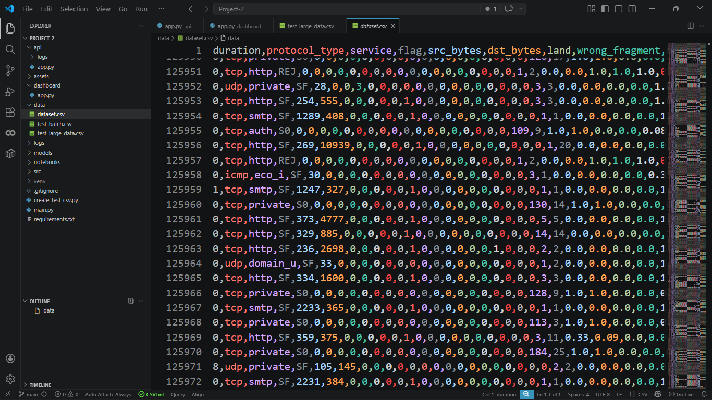
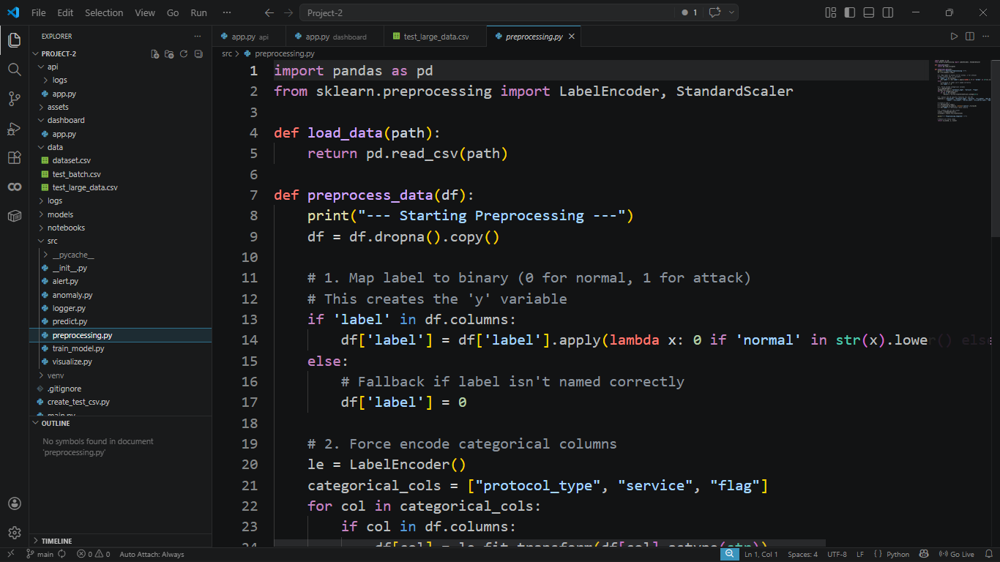
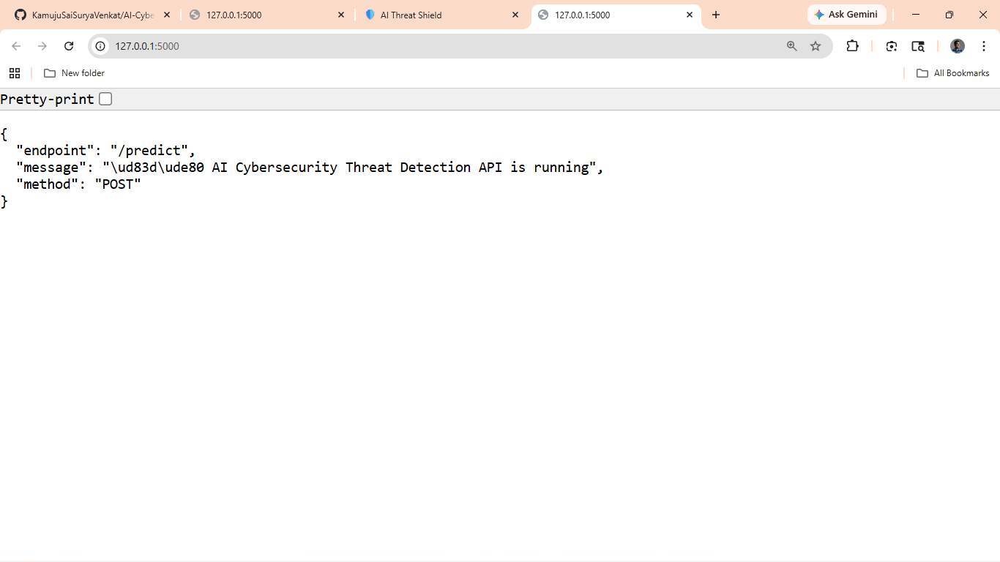
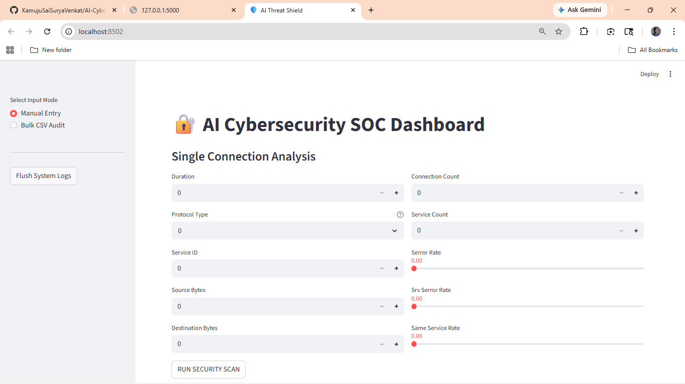
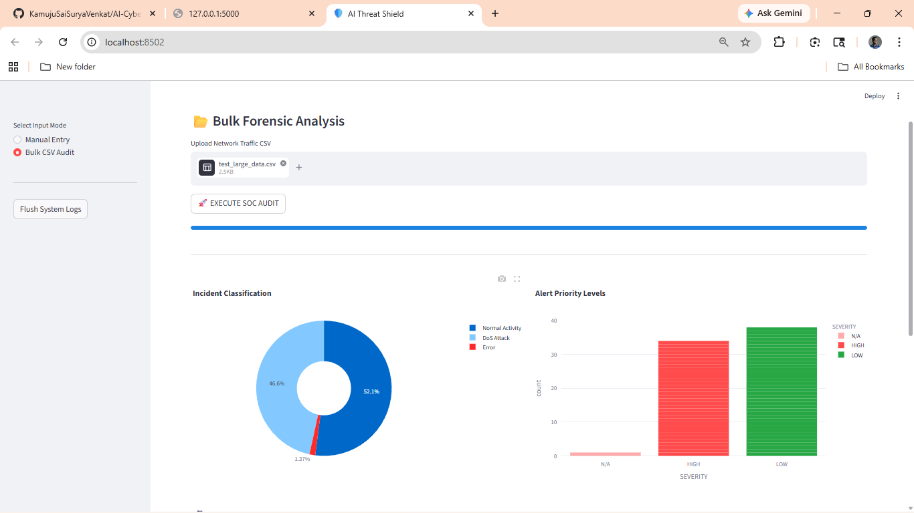
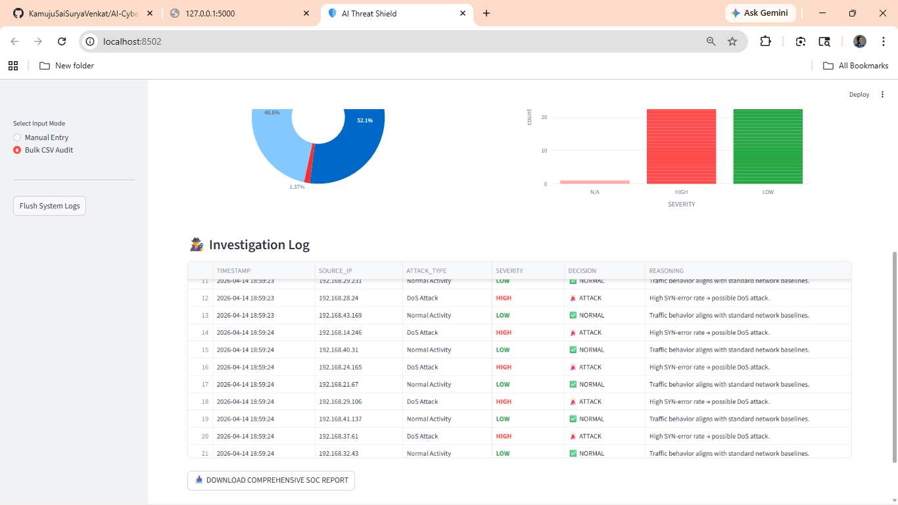

# 🛡️ AI-Powered Cybersecurity Threat Detection System


---

## 📌 Project Overview

This project is an **AI-powered Cybersecurity Threat Detection System** designed to identify malicious network activity using **Machine Learning and Anomaly Detection techniques**.

The system simulates a **real-world Security Operations Center (SOC)** environment by analyzing network traffic, detecting threats, generating alerts, and visualizing results through an interactive dashboard.

---

## ❗ Problem Statement

Modern organizations face increasing cyber threats such as:

* Distributed Denial of Service (DoS)
* Network scanning and probing
* Unauthorized access attempts
* Unknown anomalies

Traditional rule-based systems fail to detect **unknown or evolving threats**.

👉 This project solves the problem by:

* Using **Machine Learning for known attack detection**
* Using **Anomaly Detection for unknown threats**
* Providing **real-time alerts and insights**

---

## 🏭 Industry Relevance

This system closely mimics tools used in real cybersecurity environments:

* SIEM systems (Security Information & Event Management)
* SOC monitoring dashboards
* Intrusion Detection Systems (IDS)

### 💼 Real-world applications:

* Enterprise network monitoring
* Threat intelligence systems
* Incident response automation
* Cybersecurity analytics platforms

---

## 🧠 Tech Stack

### 🔹 Programming

* Python

### 🔹 Machine Learning

* Scikit-learn (Random Forest, Isolation Forest)

### 🔹 Data Processing

* Pandas, NumPy

### 🔹 Visualization

* Matplotlib, Seaborn, Plotly

### 🔹 Backend API

* Flask

### 🔹 Frontend Dashboard

* Streamlit

### 🔹 Tools

* Git, GitHub

---

## 🏗️ System Architecture

```
[User Input / CSV Upload]
            ↓
   [Streamlit Dashboard]
            ↓ (API Call)
       [Flask API]
            ↓
   [Scaler + ML Model]
            ↓
[Threat Detection + Classification]
            ↓
   [Alerts + JSON Response]
            ↓
   [Dashboard Visualization]
```

---

## 📊 Dataset Details

* Dataset Used: **NSL-KDD (Network Intrusion Detection Dataset)**
* Type: Simulated network traffic
* Contains:

  * Normal traffic
  * DoS attacks
  * Probe attacks
  * R2L & U2R attacks

### 📌 Features:

* Duration
* Protocol Type
* Service
* Source Bytes
* Destination Bytes
* Connection Count
* Error Rates

---

## ⚙️ Installation

### 🔹 1. Clone Repository

```bash
git clone https://github.com/your-username/AI-Cybersecurity-Threat-Detection-System.git
cd AI-Cybersecurity-Threat-Detection-System
```

---

### 🔹 2. Create Virtual Environment

```bash
python -m venv venv
venv\Scripts\activate   # Windows
```

---

### 🔹 3. Install Dependencies

```bash
pip install -r requirements.txt
```

---

## ▶️ How to Run

---

### 🚀 Step 1: Run Flask API

```bash
cd api
py app.py
```

API runs at:

```
http://127.0.0.1:5000/
```

---

### 📊 Step 2: Run Dashboard

```bash
cd ..
python -m streamlit run dashboard/app.py
```

Dashboard runs at:

```
http://localhost:8501
```

---

### 📁 Step 3: Upload CSV (Optional)

* Use `test_large_network_data.csv`
* Perform bulk threat analysis

---

## 📈 Results

* Achieved **high accuracy (~90%+)** on classification
* Successfully detected:

  * DoS attacks
  * Network scanning
  * Anomalous traffic

### ✅ Key Outputs:

* Threat classification
* Severity levels
* Real-time alerts
* Batch analysis via CSV

---

## 📸 Screenshots

### 📊 Dataset Preview



### ⚙️ Data Preprocessing



### 🔍 API Output



### 🛡️ Dashboard



### 📊 Bulk Analysis




---

## 🧪 Sample Output

```json
{
  "result": "🚨 ATTACK",
  "attack_type": "DoS Attack",
  "severity": "HIGH",
  "reason": "High SYN-error rate → possible DoS attack"
}
```

---

## 🎯 Learning Outcomes

Through this project, I gained:

* ✅ Understanding of cybersecurity threat patterns
* ✅ Experience with ML-based intrusion detection
* ✅ Knowledge of anomaly detection techniques
* ✅ Full-stack development (Flask + Streamlit)
* ✅ API integration and real-time systems
* ✅ GitHub project structuring and documentation

---

## 🚀 Future Improvements

* Real-time packet capture integration
* Deep learning models (LSTM / Autoencoders)
* Cloud deployment (AWS / Render)
* User authentication system
* Advanced SOC dashboard UI

---

## 💼 Author

**Sai Surya Venkat Kamuju**
AI & Cybersecurity Enthusiast

---

## ⭐ If you found this useful, consider giving it a star!
